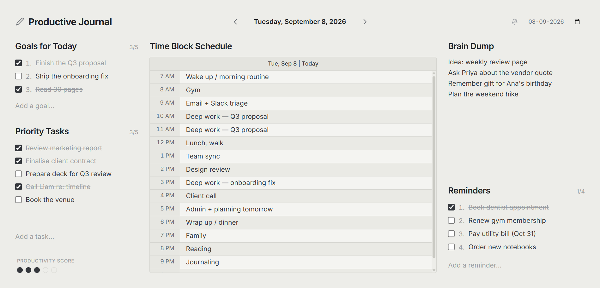
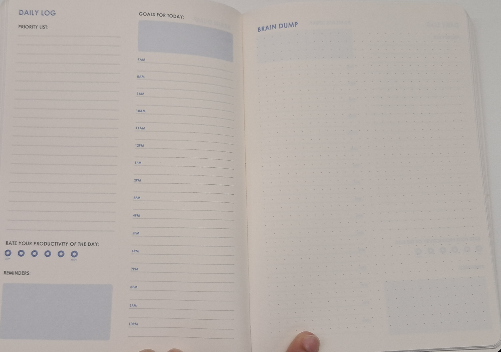

# Productive Journal

A distraction-free, offline-first desktop productivity journal — one screen, one
day, no accounts and no cloud. Everything is stored in a local SQLite file.



## Why

I could always tell whether a day *felt* productive. What I could never do was
look back at a day — or an hour — and say where the time actually went.

Paper daily-log planners solve this well: priorities, the day's goals, an hourly
time block, a brain dump, and a productivity rating, all on one spread you can
see at a glance. What they don't do is let you look back across weeks, or add
anything up.

This is that page, as a desktop app. Same layout, same one-screen constraint,
nothing extra.



*The planner page the layout is taken from.*

## What it does

- **Goals for Today** (up to 5) and **Priority Tasks** (up to 20) — checklists
- **Time Block Schedule** — 7 AM to 10 PM, one row an hour, entries wrap
- **Brain Dump** — free-form notes for whatever is in the way
- **Reminders** — a second, separate checklist
- **Productivity Score** — computed from what you actually completed, not guessed
- **History** — step back day by day, or jump to any date; past days stay editable
- **Hourly reminders** (optional, off by default) — a nudge when the current hour
  is still blank, which is the whole point: the schedule has to be filled in as
  the day happens

Everything auto-saves. There is no save button, no login, and no network access —
the app works fully offline and never sends anything anywhere.

Specs: [`Productive_Journal_Spec.md`](./Productive_Journal_Spec.md) (functional/data),
[`UI_Design_Presentation.md`](./UI_Design_Presentation.md) (layout/style).
How it was built, and what testing caught: [`docs/build-log.md`](./docs/build-log.md).

## Install on Windows

Build the installer yourself:

```bash
npm install
npm run dist
```

That writes two files into `release/`:

| File | Use |
| --- | --- |
| `Productive-Journal-Setup-1.0.0.exe` | **Installer.** Adds a Desktop and Start-menu shortcut, so the app opens with a double-click like any other program. Installs per-user — no admin rights needed. |
| `Productive-Journal-1.0.0-portable.exe` | **Portable.** A single file: double-click to run, nothing installed. Good for a USB stick. |

Your journal is stored at
`%APPDATA%\Productive Journal\productive-journal.db` and stays there when the
app is uninstalled or updated.

> **SmartScreen:** the build is unsigned, so Windows will show
> "Windows protected your PC" the first time. Click **More info → Run anyway**.
> Removing that warning requires a paid code-signing certificate.

## Commands

| Command | What it does |
| --- | --- |
| `npm run dev` | Vite dev server + Electron with hot reload |
| `npm run build` | Type-check and build renderer (`dist/`) and main (`dist-electron/`) |
| `npm start` | Build, then run the app in production mode |
| `npm test` | Both suites below (193 checks) |
| `npm run test:db` | Database, productivity formula, reminder logic, settings (104 checks) |
| `npm run test:ui` | End-to-end: drives the UI, asserts layout, persistence, notifications (89 checks) |
| `npm run rebuild` | Rebuild `better-sqlite3` against the Electron ABI |
| `npm run dist` | Package an installer via electron-builder (`release/`) |

## Structure

```text
electron/     Main process (main.mts), IPC (ipc.mts), preload bridge (preload.cts),
              settings (settings.mts), hourly reminders (notifications.mts)
database/     SQLite service layer (db.mts) + schema (schema.mts)
shared/       Types shared across the process boundary (incl. the JournalApi contract)
src/          React renderer (components, pages, hooks, services, styles)
scripts/      Verification suites
```

## Data flow

```text
React component
  -> useJournal (optimistic state, 500ms debounce for free text)
    -> window.journal.*        preload bridge, contextIsolated
      -> journal:* IPC         envelope {ok,value} | {ok,error}
        -> database/db.mts     better-sqlite3, synchronous
          -> productive-journal.db
```

After every write the day is re-read from SQLite, so the screen always shows
what was actually stored; a rejected write (for example the 21st task) surfaces
its message and is corrected by that re-read.

## Architecture notes

- **Process split.** `better-sqlite3` is synchronous and native, so all database
  work lives in the main process. The renderer never touches Node or SQLite.
- **Security.** `contextIsolation: true`, `nodeIntegration: false`, `sandbox: true`.
  The renderer's only privileged surface is `window.journal`, defined by the
  `JournalApi` interface in `shared/types.ts` and implemented in `preload.cts`.
- **Module format.** The main process is ESM (`.mts` → `.mjs`); the preload is
  CommonJS (`.cts` → `.cjs`), which is what a sandboxed preload requires.
- **Native module.** `better-sqlite3` is compiled for Node, not Electron, so
  `postinstall` runs `electron-rebuild`. Re-run `npm run rebuild` after changing
  the Electron version.

## Productivity score

Each list is scored on its own completion rate, then weighted:

```text
percent = Σ(weightᵢ × rateᵢ) / Σ(weightᵢ)      over non-empty lists only

  goals      0.50    the day's intended outcomes
  tasks      0.40    the day's priorities
  reminders  0.10    errands, not achievement
```

Rates rather than raw item counts, so a long task list cannot drown out the
goals. Empty lists drop out and the remaining weights renormalise. A day with
nothing logged scores `null` (unrated), not 0%. Set `reminders: 0` in
`PRODUCTIVITY_WEIGHTS` to exclude reminders entirely — nothing else changes.

The 0-100 result maps onto the spec's 1-5 scale in equal bands and drives the
five circles. `DailyLogs.ProductivityScore` stores **only an explicit override**:
NULL means "score this day automatically".

## Hourly reminders

Off by default. When enabled from the bell in the header, the app raises a native
OS notification on the hour (7 AM - 10 PM) if that hour's Time Block slot is still
empty; clicking it focuses the window and puts the caret in that row. Preferences
live in `settings.json` beside the database, not in it.

Spec §2 lists Notifications under "Must Not Have" for V1, so this is a deliberate
post-V1 addition, added on request and off unless switched on.
