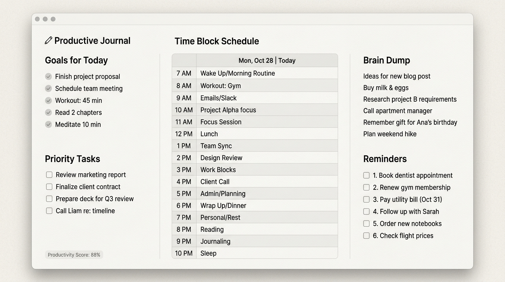

# Productive Journal - React UI Style Specification

**Version:** 1.1 (see §0)

**Target Audience:** AI Coding Agents & Frontend Developers.
**Purpose:** This document provides the exact layout, styling, and structural specifications required to build the `Productive Journal` desktop application using React.

---

## 0. Revision History

**1.1 — 2026-09-08.** Updated to match the built application. The visual
direction changed during implementation at the user's explicit request: the
mockup image above is now **authoritative for colour and surface treatment**,
where 1.0 treated it as a superseded draft.

Changes from 1.0:

- §1 — New palette: warm grey canvas `#EDEDE9`, flat sections, no card shadows.
- §1 — Alternating row tints are now **required** in the Time Block Schedule,
  reversing the 1.0 constraint that forbade them. They remain forbidden
  everywhere else.
- §2.1 — Header gains the hourly-reminder toggle.
- §3 — Productivity Score is computed from completions, with a manual override.
  It stays circles-only: no percentage is rendered.
- §3 — Time Block Schedule is a ruled table with a date strip; entries wrap.
- §3 — Reminders lost the sticky-note yellow.

Where this document and the code disagree, the code is correct: these were
deliberate decisions, not drift.

---

## 1. Global Styling & Aesthetic

The application follows the flat, warm-grey aesthetic of the mockup image above.
It should feel clean, distraction-free, and minimal — a printed planner page
rather than a dashboard of floating cards.

*   **Background Color:** Warm light grey `#EDEDE9` for the whole application
    canvas.
*   **Sections:** Flat. **No** card surface, **no** box-shadow and **no** corner
    radius — sections sit directly on the canvas and are separated by whitespace
    alone. The Time Block Schedule is the only element that draws a frame.
*   **Typography:** Modern Sans-Serif, **Inter**, bundled with the app rather
    than fetched (the app is offline-first and its CSP blocks remote fonts).
    *   Headers: Semibold, near-black (`#1F2125`).
    *   Body Text: Regular, dark grey (`#35383D`).
    *   Secondary / hour labels: `#6A6E74`. Completed & placeholder: `#9B9FA4`.
*   **Borders:** Subtle grey `#D5D5D0` for the schedule frame and its row rules.
*   **Schedule row tints:** `#F4F4F1` (odd) and `#EAEAE5` (even), with a uniform
    `#E7E7E2` hour-label gutter and an `#E4E4DF` date strip.

### Strict Constraints

*   Alternating row background colours are **required in the Time Block Schedule**
    and **forbidden everywhere else**. Goals, Priority Tasks and Reminders keep
    uniform row backgrounds.
*   **NO** bright highlights. In particular, do not turn completed items green:
    completion is expressed by greying the text and striking it through, never by
    recolouring the row.
*   No colour may carry meaning on its own — the palette is entirely neutral
    greys, and nothing in the application renders a saturated hue.

> **Changed in 1.1.** Version 1.0 forbade alternating rows outright and specified
> an off-white `#F9F9F8` canvas with white, soft-shadowed cards. Both were
> replaced on request in favour of the mockup. The prohibition on bright
> highlights and green completions is unchanged and still strictly enforced.

---

## 2. Main Layout Architecture

The application is a single-page dashboard utilizing a 3-column layout.

*   **Container:** 100vw, 100vh, `display: flex`, `flex-direction: column`.
*   **Padding:** App should have a generous outer padding (e.g., `2rem`).
*   **Gap:** Use a standard gap between columns and cards (e.g., `1.5rem` or `2rem`).

### 2.1 Header (Top)
*   Flex container at the top of the screen.
*   Left: App Title ("Productive Journal") - Large, Bold.
*   Center: Current Date (e.g., "Thursday, October 26, 2023") - Medium, Semibold,
    flanked by previous/next day arrows.
*   Right: Utilities — a "Today" shortcut (shown only when viewing another day),
    the hourly-reminder bell toggle, and a date picker.

The bell toggle carries a slash through it when reminders are off, so its state
reads without relying on colour alone.

### 2.2 Main Content Grid (Below Header)
*   `display: flex` or CSS Grid with 3 specific columns filling the remaining height.
*   **Column 1 (Left):** 25% width.
*   **Column 2 (Center):** 50% width.
*   **Column 3 (Right):** 25% width.

---

## 3. Column Component Specifications

### Column 1: Left (25% Width)
This column contains three components, stacked vertically (`flex-direction: column`, `gap: 1.5rem`).

1.  **Goals for Today (Top)**
    *   Flat section (see §1) — no card surface or shadow.
    *   Header: "Goals for Today".
    *   Content: A numbered list of 1-5 goals, each with a checkbox.
    *   The add-goal field sits **outside** the scrolling list. An outline on a
        child of `overflow: auto` is clipped at the container edge, which would
        make this field's focus ring differ from the others.
2.  **Priority Tasks (Middle)**
    *   Flat section (see §1) — no card surface or shadow.
    *   Header: "Priority Tasks".
    *   Content: A checklist of daily tasks.
    *   *Styling Rule:* Use standard checkboxes. Backgrounds of all rows must remain uniform (no alternating colors). When checked, simply strike-through the text or gray it out slightly; do NOT change the background color of the task.
3.  **Productivity Score (Bottom)**
    *   This element must be **very small and compact**.
    *   Position: Bottom left. Not a card, and it carries no heading of its own —
        only a small uppercase label.
    *   Content: five small circles (`○ ○ ○ ○ ○`, 12px), filled left-to-right for
        a 1-5 rating.
    *   **Circles only.** Do not render the percentage, the word "yours", or any
        other text score. The computed value is exposed to assistive technology
        through the group's `aria-label` instead.
    *   The circles show the **computed** rating (functional spec §4.7) unless the
        user has pinned their own. While an override is active — and only then — a
        small `reset` control appears beside the circles; without it the override
        would be a one-way door.

### Column 2: Center (50% Width)
This column contains a single, large component spanning the full height.

1.  **Time Block Schedule**
    *   Header: "Time Block Schedule".
    *   Rendered as a **ruled table** inside a `#D5D5D0` frame, with a tinted
        date strip across the top reading e.g. `Tue, Sep 8 | Today`.
    *   Content: one row per hour from **7 AM to 10 PM** (16 rows).
    *   Layout: a fixed-width hour-label gutter on the left, uniform in tone down
        the whole table, then the entry field. Rows are separated by subtle
        horizontal rules and alternate between two tints (see §1).
    *   **Entries wrap.** Each slot is a multi-line field: long text wraps to the
        column width and the row grows to fit it. Nothing scrolls horizontally
        and nothing is truncated.
    *   The field fills its row, so the whole row is clickable rather than only
        the line of text.
    *   The frame and date strip stay fixed while the rows scroll. Rows share any
        spare height, so on a taller window the table fills its box instead of
        leaving a gap beneath the last row.

### Column 3: Right (25% Width)
This column contains two components, stacked vertically. Brain Dump takes the
majority of the height (roughly 3:2 against Reminders).

1.  **Brain Dump (Top)**
    *   Header: "Brain Dump" or "Notes".
    *   Content: a large, multi-line `<textarea>` with a transparent background
        and no visible borders inside the section.
2.  **Reminders (Bottom)**
    *   Header: "Reminders".
    *   Plain background — **no** sticky-note tint. Version 1.0 permitted a faint
        warm yellow (`#FEF9C3`); the mockup has none, and it was removed in 1.1.
    *   Content: a checklist of discrete, individually-addable reminder items
        (own DB rows, not a single text blob) — each with its own checkbox,
        matching the `Reminders` table in the functional spec.
    *   *Styling Rule:* **Must use checkboxes** next to each reminder item,
        functioning exactly like a secondary to-do list (add/edit/delete/check/
        reorder), the same interaction model as Priority Tasks.

---

## 4. Implementation Guidelines for AI Agents

1.  **Framework (Strict):** Electron + React + TypeScript + Vite. Do not use Next.js.
2.  **CSS:** Tailwind CSS is highly recommended for implementing this spec rapidly (`w-1/4`, `w-1/2`, `w-1/4` for columns).
3.  **Database:** better-sqlite3 for local data storage, following the schema in the functional spec.
4.  **Responsiveness:** While primarily a desktop app, ensure the flex layout handles window resizing gracefully.
5.  **State Management:** Local React state or Context API is sufficient for V1.
6.  **Execution:** Use this document directly as the prompt context for building the React components. Do not deviate from these layout constraints without explicit user permission.
